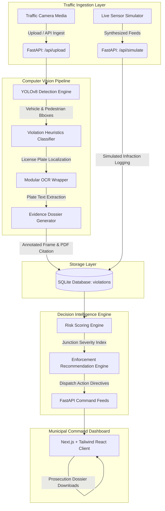

<p align="center">
  
</p>

<h1 align="center">Eye of Law</h1>
<p align="center"><strong>Adaptive Urban Traffic Intelligence & Decision-Support Platform</strong></p>

---

## System Overview

Eye of Law is an advanced, decision-support traffic enforcement platform designed for municipal traffic commissioners and transit authorities. The system processes traffic camera feeds and images to autonomously detect violations, recognize license plates via Optical Character Recognition (OCR), compute junction risk indexes, and recommend optimal enforcement patrol actions.

The platform is divided into a robust Python FastAPI backend that runs computer vision algorithms and a dynamic Next.js React frontend providing real-time data visualization and operational command capabilities.

---

## System Architecture

The following diagram illustrates the flow of data from raw sensors to active dispatch commands:



---

## Core Features

1. **Computer Vision & Violation Heuristics**:
   - **YOLOv8 Vehicle Detection**: Tracks cars, motorcycles, trucks, buses, and auto-rickshaws.
   - **Helmet Compliance**: Heuristic verification analyzing bounding box overlaps between riders and helmets.
   - **Triple Riding**: Identifies motorcycles carrying three or more overlapping individuals.
   - **Seatbelt Compliance**: Analyzes occupant cabin structures using vehicle bounding box aspect ratios.
   - **Illegal Parking**: Flags curbside blockages inside restricted spatial bounding zones.
   - **Speeding**: Simulates radar calculations by estimating cross-frame velocity.

2. **Automated Prosecution Documentation**:
   - Generates composite **Evidence Card** images with bounding box highlights and license plate text.
   - Compiles print-ready official **PDF Traffic Citations** utilizing ReportLab with custom tracking barcodes (EOL-TXN codes) and certified legal citations.

3. **Traffic Risk Scoring Engine**:
   - Computes dynamic risk indexes for urban junctions using localized infraction severity weights and short-term traffic volume multipliers:
     $$RiskScore = \sum (OffenseCount \times SeverityWeight) \times BaseRisk \times TrendMultiplier$$
   - Multiplies scoring weights up to 1.5x during surges in the past 24 hours relative to a weekly rolling average.

4. **Explainable Enforcement Recommendations**:
   - Evaluates real-time risk scores against automated dispatch rules.
   - Outputs natural language guidelines explaining the rationale behind recommend-actions (e.g., "Deploy 2 helmet checkpoint officers to Silk Board Junction during morning peak hours due to a 42% rise in violations").

5. **Decision-Support Command Dashboard**:
   - **Control Room**: Ingest files, review live bounding box visualizers, perform manual plate adjustments, and download e-prosecution tickets.
   - **Analytics Tab**: Access total violation indicators, peak hourly trend graphs, and infraction category distributions.
   - **Location Heatmap**: Leaflet-powered GIS map overlaying junction indicators colored by local risk ratings.
   - **Risk Rankings**: Priority queue of municipal intersections enabling direct officer dispatch command overrides.

---

## Installation and Setup

### Prerequisites
- Python 3.10 or higher
- Node.js v18 or higher & NPM
- Tesseract OCR (Optional: installed and accessible in the system PATH for local OCR execution)

### 1. Backend API Service
Navigate to the backend directory, install dependencies, and start the FastAPI server:

```bash
cd backend
pip install -r requirements.txt
python run.py
```
On startup, the system will verify the SQLite database state, seed 120+ historical violations if empty, and prepare static directories. The server runs at `http://localhost:8000`.

### 2. Frontend Command Client
Navigate to the frontend directory, install dependencies, and start the Next.js development server:

```bash
cd frontend
npm install
npm run dev
```
The client dashboard runs at `http://localhost:3000`.

---

## Verification & Execution Guide
1. Launch both the backend API and frontend client development environments.
2. Open `http://localhost:3000` in a web browser.
3. Access the **Control Room** tab, select an image file, choose a target junction calibration, and click **Ingest Traffic Media**. Review the crop visualizer, annotated frames, and download the compiled PDF citation.
4. Activate **Simulate Live Video** to verify real-time chart updates, Leaflet mapping markers, and priority queue ranking shifts.
