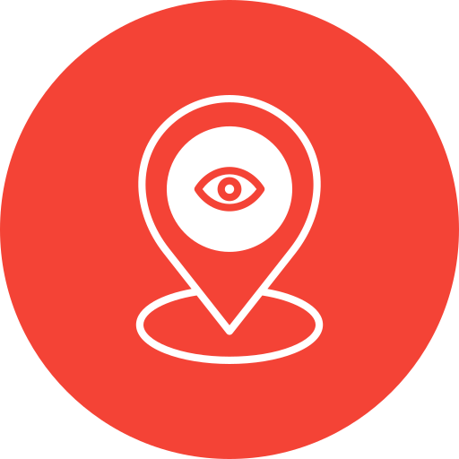
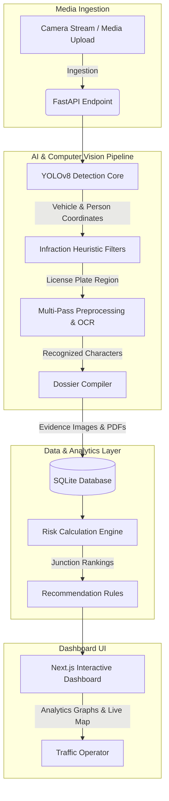

<div align="center">
  
  
  # Eye of Law
  
  *Autonomous Urban Traffic Enforcement & Decision-Support Command System.*
  
  [](https://nextjs.org/)
  [](https://fastapi.tiangolo.com/)
  [](https://www.python.org/)
  [](https://opencv.org/)
  [](https://www.sqlite.org/)
</div>

---

## Overview

**Eye of Law** is an end-to-end autonomous traffic intelligence and decision-support platform engineered for municipal traffic authorities and smart city hubs. By combining computer vision pipelines and deterministic heuristics, the platform processes traffic camera feeds to autonomously detect multiple infraction categories, perform localized license plate character recognition (OCR), rank junctions by real-time safety risk scores, and generate actionable natural language officer dispatch directives.

The system replaces manual video monitoring with automated evidence generation, helping cities optimize officer deployments and enforce traffic compliance efficiently.

---

## Features

* **Multi-Class Vehicle & Violation Detection**: Utilizes YOLOv8 and targeted geometric heuristics to detect helmet compliance, motorcycle triple-riding, seatbelt non-compliance, wrong-side driving, illegal parking, stop-line intrusion, red-light runs, and speeding.
* **Multi-Pass License Plate OCR**: Integrates a robust OCR preprocessing pipeline (Otsu, Adaptive, Inverted, and Histogram Equalized treatments) with regex-based Indian registration format validation.
* **Automated Prosecution Dossiers**: Dynamically compiles legally compliant PDF traffic citations using ReportLab, complete with unique transaction barcodes and side-by-side cropped evidence frames.
* **Junction Risk Scoring Engine**: Calculates real-time intersection priority lists using infraction severity weights and active hourly surge multipliers.
* **Explainable Dispatch Recommendations**: Interprets risk scores to output context-rich, natural language enforcement recommendations for transit dispatchers.
* **Municipal Control Center UI**: Features GIS Leaflet location heatmaps, Recharts analytics, and searchable traffic records with inline license plate crop correction.

---

## System Architecture



---

## Technology Stack

* **Frontend**: Next.js (TypeScript, TailwindCSS, Lucide Icons, Recharts, React Leaflet)
* **Backend**: FastAPI (Python 3.10+, Uvicorn)
* **AI/ML & CV**: OpenCV (Perspective Warp & CLAHE Filter), Ultralytics YOLOv8, PyTesseract OCR
* **Database**: SQLite3 (Persistent relational SQL)
* **Deployment**: Docker, Vercel

---

## Workflow

1. **Media Ingestion**: Operators upload a traffic camera image in the **Control Room** or trigger the real-time simulation stream.
2. **OpenCV Preprocessing**: The system applies adaptive contrast stretching (CLAHE) and bilateral noise reduction filters to mitigate lighting and shadow artifacts.
3. **Object Detection**: The frame is passed through YOLOv8 to localize and identify vehicles and individuals.
4. **Heuristic Classification**: Geometric intersection and HSV color algorithms verify traffic violations (e.g., measuring head-area Hough circles for helmets, windshield diagonal edges for seatbelts, and taillight/headlight ratios for travel direction).
5. **OCR Extraction**: License plates are cropped, perspective-corrected, and evaluated across multiple threshold treatments to isolate characters.
6. **Prosecution Asset Generation**: The database saves the violation, writes a cropped image of the plate, compiles an official PDF citation ticket, and updates the command room priority queue.

---

## Screenshots

*Placeholders for application dashboard view:*

* **Executive Dashboard**: `[Insert screenshot of main Executive Analytics view showing Recharts and Leaflet Map here]`
* **Control Room Ingestion**: `[Insert screenshot of Control Room showing bounding overlay visualizer and Ingestion Log Cards here]`
* **Searchable Records**: `[Insert screenshot of Searchable Records showing license plate crops and PDF download buttons here]`

---

## Installation

### Prerequisites
- Python 3.10+
- Node.js v18+ & NPM
- Tesseract OCR (Optional: installed and accessible in the system PATH for local OCR execution)

### 1. Backend API Service
```bash
cd backend
pip install -r requirements.txt
```

### 2. Frontend Command Client
```bash
cd frontend
npm install
```

---

## Running the Project

### Start Backend
```bash
cd backend
python run.py
```
*The FastAPI server will start on `http://localhost:8000`. On startup, it automatically migrates the SQLite database schema and seeds historical records if the database is missing.*

### Start Frontend
```bash
cd frontend
npm run dev
```
*The Next.js client dashboard will start on `http://localhost:3000`.*

---

## Project Structure

```
├── backend/
│   ├── app/
│   │   ├── config.py          # Platform constants and junction coordinates
│   │   ├── cv_engine.py       # YOLOv8 heuristics, OCR, and card generator
│   │   ├── db.py              # SQLite connection, schemas, and Bangalore seed data
│   │   ├── main.py            # FastAPI route controllers
│   │   ├── models.py          # Pydantic schema validation structures
│   │   └── pdf_generator.py   # ReportLab PDF citation layout configuration
│   ├── run.py                 # FastAPI uvicorn execution entrypoint
│   └── Dockerfile             # Container configuration for backend deployment
├── frontend/
│   ├── src/
│   │   ├── components/        # Dynamic Leaflet Risk Map component
│   │   └── app/
│   │       ├── layout.tsx     # Global HTML/TypeScript structure
│   │       └── page.tsx       # Unified Dashboard page code
│   └── package.json           # Frontend dependencies
├── logo.png                   # Centered project branding asset
└── README.md                  # Hackathon documentation
```

---

## Future Scope

* **Video Stream Processing**: Transition from single-frame analysis to real-time RTSP video stream processing using multi-object tracking (ByteTrack).
* **Automatic License Plate Reading (ALPR) Watchlists**: Integrate automated alerts that flag stolen, unregistered, or blacklisted vehicle plates instantly.
* **Edge Deployment**: Optimize the YOLO models for deployment on edge devices like NVIDIA Jetson Nano modules on traffic poles.

---

## Team

* **Aryan Shan** - *Lead Developer / Systems Engineer* - [GitHub Profile](https://github.com/Aryan-Shan)

---

## License

This project is licensed under the MIT License - see the LICENSE file for details.
